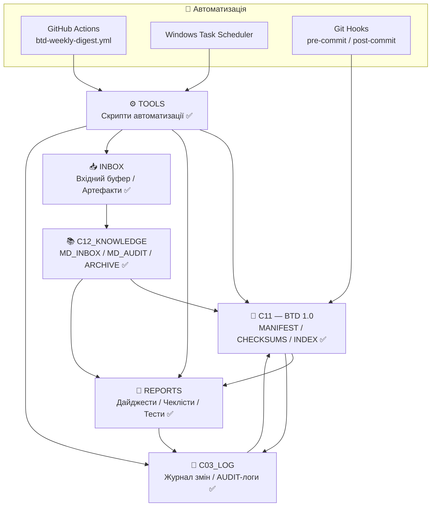

```mermaid
flowchart TD

  INBOX["📥 INBOX\nВхідний буфер / Артефакти ✅"]
  C12["📚 C12_KNOWLEDGE\nMD_INBOX / MD_AUDIT / ARCHIVE ✅"]
  C11["📘 C11 — BTD 1.0\nMANIFEST / CHECKSUMS / INDEX ✅"]
  C03["📑 C03_LOG\nЖурнал змін / AUDIT-логи ✅"]
  RPT["📝 REPORTS\nДайджести / Чеклісти / Тести ✅"]
  TOOLS["⚙️ TOOLS\nСкрипти автоматизації ✅"]

  INBOX --> C12
  C12   --> C11
  C11   --> RPT
  C11   --> C03
  TOOLS --> C11
  TOOLS --> RPT
  TOOLS --> INBOX
  TOOLS --> C03

  subgraph AUTO[🔄 Автоматизація]
    GH[GitHub Actions\nbtd-weekly-digest.yml]
    TS[Windows Task Scheduler]
    HOOKS[Git Hooks\npre-commit / post-commit]
  end

  HOOKS --> C11
  TS    --> TOOLS
  GH    --> TOOLS

  RPT --> C03
  C03 --> C11
  C12 --> RPT
```
