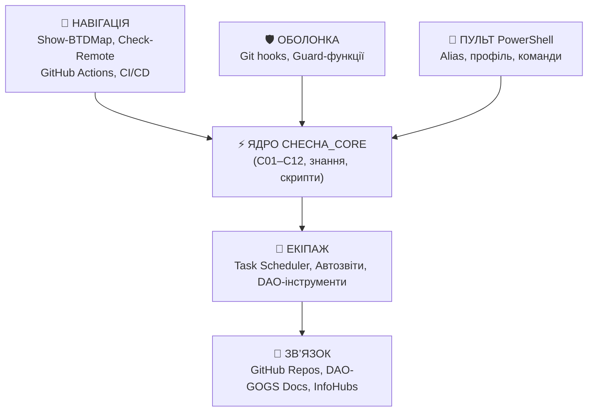

```mermaid
flowchart TD
  NAV["🌌 НАВІГАЦІЯ<br/>Show-BTDMap, Check-Remote<br/>GitHub Actions, CI/CD"]
  CORE["⚡ ЯДРО CHECHA_CORE<br/>(C01–C12, знання, скрипти)"]
  PANEL["🧭 ПУЛЬТ PowerShell<br/>Alias, профіль, команди"]
  SHIELD["🛡 ОБОЛОНКА<br/>Git hooks, Guard-функції"]
  CREW["🤖 ЕКІПАЖ<br/>Task Scheduler, Автозвіти, DAO-інструменти"]
  LINK["📡 ЗВ’ЯЗОК<br/>GitHub Repos, DAO-GOGS Docs, InfoHubs"]

  NAV --> CORE
  SHIELD --> CORE
  PANEL --> CORE
  CORE --> CREW
  CREW --> LINK
```