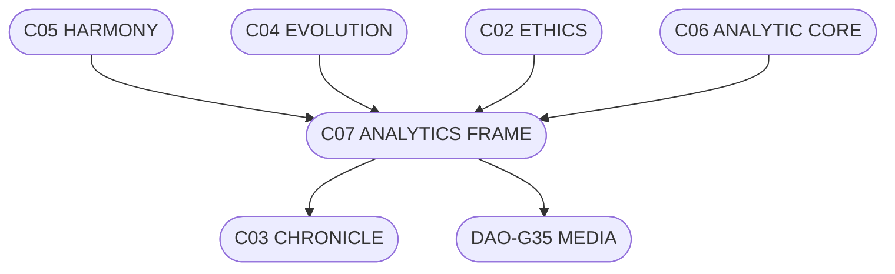

# C07.6_VISUAL_FLOW.md
## ВІЗУАЛЬНИЙ ПОТІК АНАЛІТИКИ

### ASCII-схема потоків
```
        [ C06 ANALYTIC CORE ]
                  │
  ┌───────────────┼────────────────┐
  │               │                │
[C05 HARMONY] [C04 EVOLUTION] [C02 ETHICS]
  │               │                │
  └─────► [ C07 ANALYTICS FRAME ] ◄──────┘
                  │
              [ C03 CHRONICLE ]
                  │
              [ DAO-G35 MEDIA ]
```

### Mermaid-діаграма


### Легенда
- **C02 ETHICS** — етичні принципи.
- **C04 EVOLUTION** — шари розвитку.
- **C05 HARMONY** — рівновага.
- **C06 ANALYTIC CORE** — ядро свідомої аналітики.
- **C07 FRAME** — центральна оболонка спостереження.
- **DAO-G35 MEDIA** — зовнішній дзеркальний шар.

**Підпис:** `С.Ч.`  
**Шлях:** `D:\CHECHA_CORE\CONSTITUTION\C07_ANALYTICS\C07.6_VISUAL_FLOW.md`
