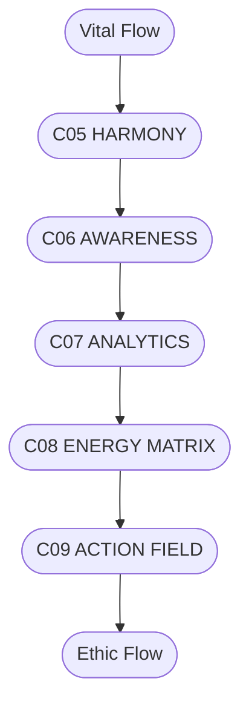

# C08.5_ENERGY_FLOW.md
## ПОТОКИ ЕНЕРГІЇ СИСТЕМИ CHECHA_CORE

### 1. Потоки
- **Vital Flow** — забезпечує живлення та життєву силу.  
- **Info Flow** — поширює знання, аналітику, досвід.  
- **Ethic Flow** — очищає, узгоджує і стабілізує наміри.

---

### 2. ASCII-схема потоків
```
     [ Vital Flow ]
          ↓
[C05 HARMONY] → [C06 AWARENESS] → [C07 ANALYTICS]
          ↓                       ↑
     [C09 ACTION FIELD] ← [C08 ENERGY MATRIX]
          ↑
     [ Ethic Flow ]
```

---

### 3. Mermaid-діаграма


---

### 4. Легенда
- **Vital Flow** — енергія життя.  
- **Info Flow** — знання як форма руху.  
- **Ethic Flow** — очищення й узгодження наміру.  
- **C05–C09** — еволюційний цикл системи.

---

### 5. Підпис
`С.Ч.`  
**Шлях:** `D:\CHECHA_CORE\CONSTITUTION\C08_ENERGY\C08.5_ENERGY_FLOW.md`
