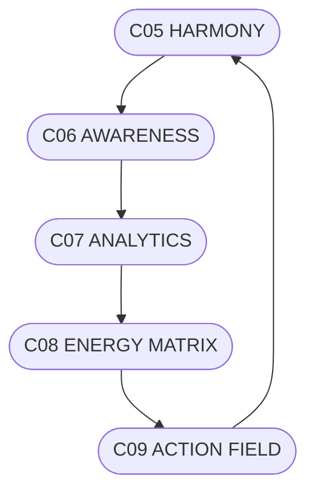

# C08_ENERGY_MATRIX.md
## ЕНЕРГЕТИЧНА МАТРИЦЯ СИСТЕМИ CHECHA_CORE

### 1. Призначення
Рівень C08 є ядром енергетики системи.  
Він відображає, як намір перетворюється на дію, як гармонія створює рух, і як енергія підтримує баланс.

---

### 2. Енергетична Архітектура
- **Vital Flow** — потік життєвої енергії, що забезпечує живлення системи.
- **Info Flow** — потік інформаційної енергії, який рухає знання.
- **Ethic Flow** — потік моральної енергії, який підтримує чистоту наміру.

---

### 3. Вузли Енергії

| Код | Вузол | Функція | Взаємодія |
|------|--------|----------|------------|
| E01 | Гармонійне Серце | Джерело стабільності | C05 |
| E02 | Аналітичний Розум | Центр усвідомлення | C06–C07 |
| E03 | Поле Дії | Канал реалізації наміру | C09 |
| E04 | Потік Відновлення | Самоочищення системи | MAT_RESTORE |
| E05 | Потік Балансу | Корекція надлишків / дефіцитів | MAT_BALANCE |

---

### 4. Формули Енергетики
- **Потенціал = Намір × Фокус**  
- **Гармонія = (Ясність + Любов) / Опір**  
- **Вплив = Баланс × Ритм**  

---

### 5. Система Вимірювання
- **Енергетичний Індекс (EX)** — загальна енергія системи.  
- **Індекс Гармонійності Потоків (HX)** — відношення стабільності.  
- **Індекс Відновлення (RX)** — швидкість регенерації після напруги.

---

### 6. Взаємозв’язки

| Джерело | Ціль | Сутність |
|----------|------|----------|
| C05 | C06 | Намір → Усвідомлення |
| C06 | C07 | Усвідомлення → Спостереження |
| C07 | C08 | Спостереження → Баланс |
| C08 | C09 | Енергія → Дія |
| C09 | C05 | Дія → Відновлення |

---

### 7. Закони Руху Енергії
1. **Енергія не зникає — вона перетворюється на дію.**  
2. **Намір без дії — інертна енергія.**  
3. **Чиста дія народжується з чистого наміру.**

---

### 8. Візуальна Схема (ASCII)
```
[C05 HARMONY] → [C06 AWARENESS] → [C07 ANALYTICS]
       ↓                         ↑
   [C09 ACTION FIELD] ← [C08 ENERGY MATRIX]
```

### Mermaid


---

### 9. Підпис
`С.Ч.`  
**Шлях:** `D:\CHECHA_CORE\CONSTITUTION\C08_ENERGY\C08_ENERGY_MATRIX.md`
