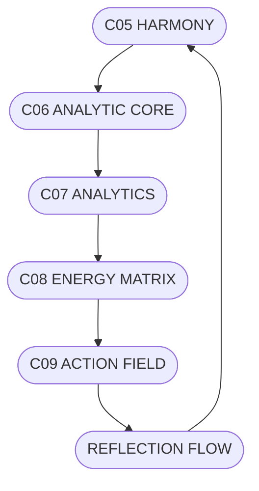

# C09.5_ACTION_FLOW.md
## ПОТОКИ РЕАЛІЗАЦІЇ ДІЇ СИСТЕМИ CHECHA_CORE

### 1. Призначення
Документ відображає, як енергія з рівня C08 переходить у конкретні події рівня C09, створюючи гармонійний рух системи.

---

### 2. Потоки
- **Intention Flow** — напрямок від ідеї до дії.  
- **Action Flow** — реальна реалізація.  
- **Reflection Flow** — зворотний аналіз і вдосконалення.  

---

### 3. ASCII-схема
```
[C05 HARMONY] → [C06 ANALYTIC CORE] → [C07 ANALYTICS]
        ↓                            ↑
   [C09 ACTION FIELD] ← [C08 ENERGY MATRIX]
        ↑
 [REFLECTION FLOW → C05 HARMONY]
```

---

### 4. Mermaid-діаграма


---

### 5. Принципи Потоку
1. Потік діє лише тоді, коли є гармонія між наміром і енергією.  
2. Рух без рефлексії — втрата напрямку.  
3. Рефлексія повертає енергію у чистий стан.

---

### 6. Підпис
`С.Ч.`  
**Шлях:** `D:\CHECHA_CORE\CONSTITUTION\C09_ACTION\C09.5_ACTION_FLOW.md`
