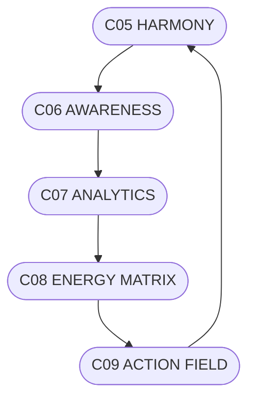

# C09_ACTION_FIELD.md
## ПОЛЕ ДІЇ СИСТЕМИ CHECHA_CORE

### 1. Призначення
C09 — це рівень реалізації намірів системи. Тут енергія перетворюється на рух, рішення — на події, а ідеї — на реальні зміни.

---

### 2. Джерела Дії
- **C05 HARMONY** — джерело чистоти наміру.  
- **C06 ANALYTIC CORE** — усвідомлення закономірностей.  
- **C07 ANALYTICS** — спостереження й моніторинг.  
- **C08 ENERGY MATRIX** — живлення та сила руху.

---

### 3. Типи Дії
| Тип | Сфера | Опис |
|------|--------|------|
| Фізична | Матеріальна | Практична реалізація, технічне втілення. |
| Соціальна | Людська | Взаємодія, комунікація, об’єднання. |
| Інформаційна | Знання | Поширення ідей, контент, освіта. |
| Духовна | Внутрішня | Перетворення свідомості, гармонізація. |

---

### 4. Алгоритм Дії
1. Намір.  
2. Аналіз.  
3. Енергія.  
4. Рішення.  
5. Дія.  
6. Рефлексія.

**Формула:**  
`Дія = Намір + (Аналіз × Енергія)`

---

### 5. Механізми Реалізації (DAO-модулі)
| Код | Назва | Функція |
|------|--------|----------|
| G09 | Coalition / Media Alliance | Координація партнерів та ЗМІ. |
| G11 | Leadership | Лідерство та прийняття рішень. |
| G35 | Media Contour | Публікація, комунікація. |
| G43 | ITETA | Еволюційна аналітика та прогнозування. |
| G45 | Shield | Захист, стабільність, стратегічна безпека. |

---

### 6. Закони Дії
1. **Дія без наміру — хаос.**  
2. **Намір без дії — застій.**  
3. **Єдність наміру й дії — творення.**

---

### 7. Формули Впливу
- **Вплив = Якість Наміру × Узгодженість × Ритм**  
- **Результат = Вплив × Стійкість / Опір**

---

### 8. Візуальна Карта (ASCII)
```
[C05 HARMONY] → [C06 AWARENESS] → [C07 ANALYTICS]
       ↓                         ↑
   [C09 ACTION FIELD] ← [C08 ENERGY MATRIX]
```
---

### 9. Mermaid


---

### 10. Підпис
`С.Ч.`  
**Шлях:** `D:\CHECHA_CORE\CONSTITUTION\C09_ACTION\C09_ACTION_FIELD.md`
