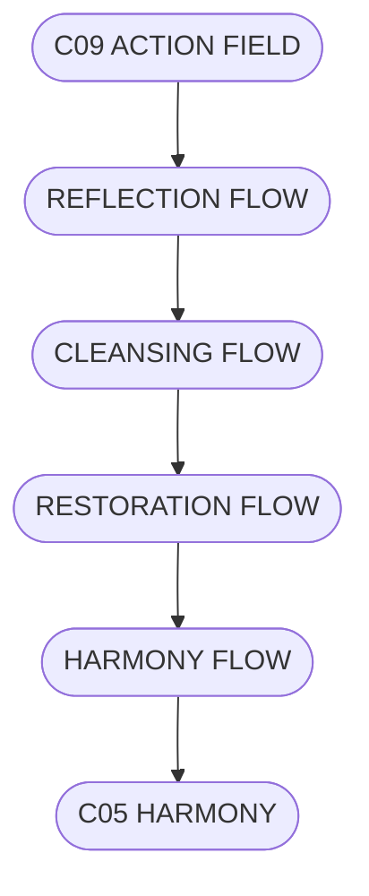

# C10.5_RESTORATION_FLOW.md
## ПОТІК ВІДНОВЛЕННЯ СИСТЕМИ CHECHA_CORE

### 1. Призначення
Потік Відновлення описує замикання циклу енергії та наміру в системі CHECHA_CORE.  
Він показує, як дія повертається у спокій, а енергія — у гармонію.

---

### 2. Основні Потоки
- **Reflection Flow** — усвідомлення та прийняття досвіду.  
- **Cleansing Flow** — очищення, вивільнення напруги.  
- **Restoration Flow** — повернення до рівноваги.  
- **Harmony Flow** — завершення та початок нового циклу.

---

### 3. ASCII-схема
```
[C09 ACTION FIELD]
       ↓
 [REFLECTION FLOW]
       ↓
 [CLEANSING FLOW]
       ↓
 [RESTORATION FLOW]
       ↓
 [HARMONY FLOW → C05 HARMONY]
```

---

### 4. Mermaid-діаграма


---

### 5. Принципи Потоку
1. Кожен рух має повернення.  
2. Очищення є шляхом до нової ясності.  
3. Відновлення — це не кінець, а перехід.

---

### 6. Підпис
`С.Ч.`  
**Шлях:** `D:\CHECHA_CORE\CONSTITUTION\C10_RESTORE\C10.5_RESTORATION_FLOW.md`
