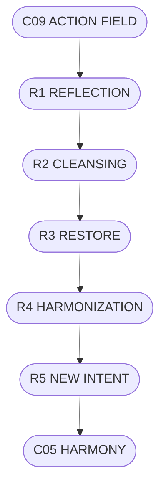

# C10_RESTORATION_CYCLE.md
## ЦИКЛ ВІДНОВЛЕННЯ СИСТЕМИ CHECHA_CORE

### 1. Призначення
Рівень C10 — це механізм відновлення гармонії системи після дії.  
Його мета — очищення потоків, стабілізація енергії та повернення ясності наміру.  
Він замикає коло між C05 (Гармонія) та C09 (Дія).

---

### 2. Етапи Циклу Відновлення

| Етап | Назва | Функція |
|------|--------|----------|
| R1 | Рефлексія | Усвідомлення результатів дії |
| R2 | Очищення | Звільнення від надлишків і напруги |
| R3 | Відновлення | Повернення енергії у рівновагу |
| R4 | Гармонізація | Відновлення ясності та любові |
| R5 | Підготовка нового циклу | Народження нового наміру |

---

### 3. Формули Відновлення
- **Відновлення = Рефлексія × Чесність**  
- **Чистота = (Істина + Спокій) / Опір**  
- **Ритм = Гармонія / Перевантаження**

---

### 4. Закони Відновлення
1. **Відновлення без усвідомлення — повторення помилки.**  
2. **Усвідомлення без дії — стагнація.**  
3. **Очищення народжує новий рух.**

---

### 5. Механізми Автоматизації
- **MAT_RESTORE** — матриця відновлення.  
- **MAT_BALANCE** — баланс аналітичного й енергетичного ритму.  
- **Run-RestoreLog** — щоденний лог очищення стану.

---

### 6. Візуальна Схема (ASCII)
```
[C09 ACTION FIELD] → [R1 REFLECTION] → [R2 CLEANSING]
       ↓                                ↓
  [R3 RESTORE] → [R4 HARMONIZATION] → [R5 NEW INTENT]
       ↓
   [C05 HARMONY]
```

---

### 7. Mermaid


---

### 8. Підпис
`С.Ч.`  
**Шлях:** `D:\CHECHA_CORE\CONSTITUTION\C10_RESTORE\C10_RESTORATION_CYCLE.md`
