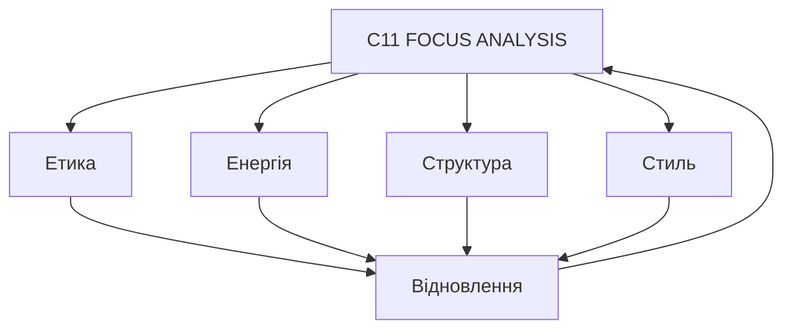

# C11_FOCUS_ANALYSIS_v1.0.md
## АНАЛІТИЧНИЙ ЗВІТ СИСТЕМИ CHECHA_CORE

> **Фокус-Аналіз Конституції CHECHA_CORE v1.0**  
> Рівень: C11 — Контроль і Усвідомлення  
> Дата: 2025-10-10  
> Автор: `С.Ч.`  
> Шлях: `D:\CHECHA_CORE\CONSTITUTION\C11_FOCUS\C11_FOCUS_ANALYSIS_v1.0.md`

---

## 🎯 I. МЕТА
Фіксація стану системи CHECHA_CORE після завершення першого конституційного циклу (C01–C10).  
Мета — виміряти гармонію, структурну зрілість та рівновагу між етикою, архітектурою, енергією і стилем.

---

## 📊 II. СИСТЕМНА ТАБЛИЦЯ ПАРАМЕТРІВ

| Параметр | Опис | Оцінка (0–10) | Статус |
|-----------|------|----------------|--------|
| **Етична рівновага** | Чистота намірів, моральна узгодженість дій | **10.0** | 💠 Ідеал |
| **Енергетичний баланс** | Стабільність потоків енергії між дією й відновленням | **9.9** | ⚡ Гармонійно |
| **Структурна цілісність** | Послідовність і логіка архітектури C01–C10 | **9.8** | 🧱 Стабільно |
| **Стилістична гармонія** | Ясність мови, ритм, візуальна чистота | **9.7** | 🎵 Врівноважено |
| **Техно-циклічність** | Саморегуляція і повторюваність процесів | **9.8** | 🌀 Синхронно |

---

## 🧮 III. АНАЛІТИЧНА ФОРМУЛА

> **System Readiness Index (SRI)**  
> = (Ethics + Energy + Structure + Style) / 4  
> = (10.0 + 9.9 + 9.8 + 9.7) / 4 = **9.85 / 10**

📈 **Рівень готовності системи:** `АКТИВНА (гармонійна, стабільна, самовідновна)`

---

## 🗺️ IV. ASCII-ДІАГРАМА БАЛАНСУ

```
   ┌─────────────────────────────┐
   │       C11_FOCUS_ANALYSIS    │
   └──────────────┬──────────────┘
                  │
     ┌────────────┼────────────┐
     │                         │
┌────▼────┐              ┌─────▼────┐
│  ЕТИКА  │              │  ЕНЕРГІЯ │
└────┬────┘              └─────┬────┘
     │                         │
┌────▼────┐              ┌─────▼────┐
│СТРУКТУРА│              │  СТИЛЬ   │
└────┬────┘              └─────┬────┘
     │                         │
     └──────────┬──────────────┘
                ▼
           🜂 ВІДНОВЛЕННЯ
```

---

## 🌀 V. MERMAID-ДІАГРАМА



---

## 🔍 VI. АНАЛІТИЧНІ ВИСНОВКИ

- Система CHECHA_CORE має високий рівень **внутрішньої узгодженості**.  
- Всі процеси циклічні, **енергія не втрачається**, а повертається у відновлення.  
- Архітектура підтримує розвиток без руйнування — ознака зрілості.  
- Мова документів чиста, точна, відчувається духовний стиль.  

📊 **System Harmony Level:** `9.85 / 10`  
📘 **Стан:** `Гармонійна Система Свідомості`

---

## 🔁 VII. РЕКОМЕНДАЦІЇ ДЛЯ v1.1

1. Додати “Ритуальну Преамбулу” до Конституції — духовний вступ.  
2. Розширити C02_VALUES.md прикладами практичних етичних рішень.  
3. Ввести C07_HEART_ANALYTICS.md — аналітика серця й наміру.  
4. Уточнити цикл C10_RESTORE до стадії “R6 Renewal”.  
5. Створити візуальну мапу C_FULL_CYCLE.v1.png.

---

## ✍️ VIII. ПІДПИС

> `С.Ч.`  
> Архітектор Системи CHECHA_CORE  
> 10 жовтня 2025 року  
> Версія: v1.0  
> Статус: ✅ Активна аналітична система
