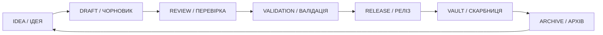

# C12_ARTIFACT_TEMPLATE.md
# [ARTIFACT_ID]: C12-KA-XXXX
## 📘 ЕТАЛОННИЙ ШАБЛОН ЗНАННЯ / KNOWLEDGE ARTIFACT TEMPLATE

**Версія:** v1.0  
**Автор:** С.Ч.  
**Дата створення:** 10.10.2025  
**Canonical Path:** D:\CHECHA_CORE\CONSTITUTION\C12_KNOWLEDGE\C12_ARTIFACT_TEMPLATE.md  
**Рівень:** C12 — Knowledge Vault  
**Статус:** Еталон шаблону знання  
**Мова:** Українська / English  

---

## 🜂 1. СУТЬ / ESSENCE
> Коротко сформулюй суть артефакту: що саме це знання дає системі, яку ідею несе.

**Суть:**  
_Тут описується основна ідея, принцип, метод чи відкриття._  

---

## 🜃 2. КОНТЕКСТ / CONTEXT
> Де, коли і чому виникло це знання. Яка ситуація або проблема привела до його створення.

**Контекст:**  
_Тут можна зазначити походження, автора, момент відкриття або умови, за яких знання набуло форми._  

---

## 🜄 3. ПОЗИТИВНИЙ ВЗІРЕЦЬ / POSITIVE PATTERN
> Як це знання допомагає, підсилює або лікує систему.

**Опис:**  
_Приклад правильного застосування._

**Результат:**  
_Який ефект отримується при гармонійному використанні._  

---

## 🜁 4. НЕГАТИВНИЙ ВЗІРЕЦЬ / NEGATIVE PATTERN
> Як неправильне або викривлене використання цього знання шкодить системі.

**Помилка:**  
_Опиши, як може проявитись неправильна форма._

**Наслідок:**  
_Які ризики або втрати виникають._  

---

## ⚙️ 5. ВИКОРИСТАННЯ / APPLICATION
> Де і як це знання застосовується в системі CHECHA_CORE або DAO-GOGS.

| Сфера | Модуль | Приклад використання |
|--------|---------|----------------------|
| Етика | C02 / G01 | Використовується як принцип поведінки |
| Автоматизація | C07 / G02 | Вбудовано в процес перевірки |
| Аналітика | C06 / G03 | Використовується в матриці RESTORE |

---

## 🧩 6. ЗВ’ЯЗКИ / LINKS
> Вкажи зв’язки цього знання з іншими шарами.

| Пов’язано з | Рівень | Тип зв’язку |
|--------------|---------|--------------|
| C02_VALUES.md | C02 | Етична основа |
| C07_ANALYTICS | C07 | Аналітичне застосування |
| G43_ITETA | DAO | Дослідницький зв’язок |

---

## 🌐 7. ASCII-СХЕМА “ЕНЕРГІЯ ЗНАННЯ” / ENERGY FIELD

```
        +----------------------------+
        |      Джерело / Source      |
        +--------------+-------------+
                       |
                       ▼
        +--------------+-------------+
        |     Суть / Essence         |
        +--------------+-------------+
                       |
                       ▼
        +--------------+-------------+
        |   Дія / Application        |
        +--------------+-------------+
                       |
                       ▼
        +--------------+-------------+
        |   Резонанс / Impact        |
        +----------------------------+
```

---

## 🌀 8. ЖИТТЄВИЙ ЦИКЛ / LIFE CYCLE
> Від народження ідеї до архівування знання.



---

## 🕊️ 9. ЦИТАТА-ПЕЧАТКА / SIGNATURE QUOTE
> “Світло знання народжується з порядку.” — С.Ч.

---

**CHECHA_CORE | C12_ARTIFACT_TEMPLATE v1.0**  
**DAO-GOGS LINKED MODULE: G12_KNOWLEDGE_ARCHIVE**
