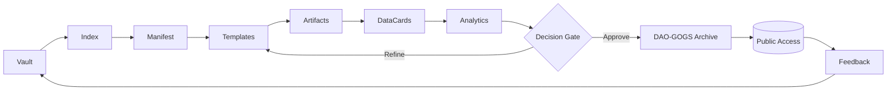

# C12_CONTROL_SUMMARY.md  
**Рівень:** C12 — Контроль і Узгодження Ядра Знань  
**Версія:** v1.0  
**Автор:** С.Ч.  
**Стиль:** Священно-технологічний  
**Офіційний шлях у структурі:**  
`D:\CHECHA_CORE\CONSTITUTION\C12_KNOWLEDGE\C12_CONTROL_SUMMARY.md`

---

## 1) Мета і Роль документа
**C12_CONTROL_SUMMARY** — це *єдина панель контролю* для Скарбниці Знань.  
Він дає цілісну картину: що вже створено, як пов’язано, в якому стані, що оновлюється далі.  
Керувальний принцип: **“Чіткий шлях, чітка структура, ефективний рух.”**

> “Порядок знань — це спокій системи.” — **С.Ч.**

---

## 2) Архітектурний контур C12
| Шар | Елемент | Роль | Офіційний шлях | Примітка |
|---|---|---|---|---|
| C12 | **Vault** | Сховище артефактів і документів | `D:\CHECHA_CORE\CONSTITUTION\C12_KNOWLEDGE\VAULT\` | Джерело правди (SoT) |
| C12 | **Index** | Індекс/реєстр артефактів | `D:\CHECHA_CORE\CONSTITUTION\C12_KNOWLEDGE\INDEX\` | Ключі доступу і навігації |
| C12 | **Manifest** | Правила, ритми, стилі | `D:\CHECHA_CORE\CONSTITUTION\C12_KNOWLEDGE\MANIFEST.md` | Ритуали оновлень |
| C12 | **Templates** | Шаблони та макети | `D:\CHECHA_CORE\CONSTITUTION\C12_KNOWLEDGE\TEMPLATES\` | Уніфікація форми |
| C12 | **Analytics** | Аналітика/метрики | `D:\CHECHA_CORE\CONSTITUTION\C12_KNOWLEDGE\ANALYTICS\` | Контроль якості знань |
| C12 | **DataCards** | Дані-паспорти артефактів | `D:\CHECHA_CORE\CONSTITUTION\C12_KNOWLEDGE\DATACARDS\` | Атрибутика і SLAs |
| C12 | **DAO-GOGS** | Архів узгоджених знань | `D:\CHECHA_CORE\G12_ARCHIVE\DAO_GOGS\` | Публічний шар збереження |

---

## 3) Матриця стану (огляд)
> Примітка: статуси **Draft / Review / Final / Canon**; пріоритети **P1–P3**; ритм — у MANIFEST.

| ID | Назва | Стан | Пріоритет | Власник | Останнє оновлення |
|---|---|---|---|---|---|
| C11 | `C11_CONSTITUTION_MAP.md` | **Final** | P1 | С.Ч. | — |
| C12 | `C12_CONTROL_MATRIX.md` | **Review** | P1 | С.Ч. | — |
| C12 | `C12_CONTROL_SUMMARY.md` | **Final** | P1 | С.Ч. | 2025-10-10 UTC |
| C02 | `C02_VALUES.md` | **Final** | P1 | С.Ч. | — |
| Cxx | `MANIFEST.md` | **Final** | P1 | С.Ч. | — |
| Cxx | `TEMPLATES/*` | **Review** | P2 | С.Ч. | — |
| G12 | `G12_KNOWLEDGE_ARCHIVE/*` | **Active** | P1 | С.Ч. | — |

---

## 4) Зв’язки з G12 (DAO-GOGS)
- **DAO-GOGS ⇆ Vault:** синхронізація перевірених артефактів (*Final → Canon → Archive*).  
- **Index ⇆ DAO-GOGS:** віддзеркалення ідентифікаторів/версій.  
- **Manifest:** визначає коли і що саме публікуємо у G12.

---

## 5) Mermaid: “C12 Knowledge Loop”

**Пояснення циклу:**  
1) **Vault → Index**: артефакти додаються і отримують індекс.  
2) **Manifest → Templates**: застосовується ритм/правила та шаблони.  
3) **Artifacts → DataCards → Analytics**: формується паспорт, проводиться оцінка якості.  
4) **Decision Gate**: або доопрацювання (Refine), або узгодження і публікація (Approve).  
5) **DAO-GOGS → Feedback**: архів + зворотний зв’язок живить Vault.

---

## 6) Політика версій і якості
- **Версії:** `vMAJOR.MINOR.PATCH` (напр., v1.0.0)  
- **Стани:** Draft → Review → Final → Canon  
- **Контроль якості:** перевірки змісту (Logic, Ethics, Source), форми (Style, Template), доступності (Index, Path).  
- **Критичний принцип шляху:** кожен документ містить **Офіційний шлях** у шапці.

---

## 7) Ролі і ритми
- **Власник шару C12:** С.Ч.  
- **Оновлення:** відповідно до `MANIFEST.md` (ритм циклів постачання і ревізій).  
- **Канонізація:** рішення через **Decision Gate** з фіксацією в `Analytics` та публікацією в `DAO-GOGS`.

---

## 8) Печатка документа
> “Рівновага структури народжується з дисципліни оновлення.” — **С.Ч.**
