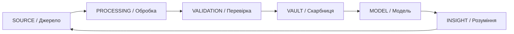

# C12_DATA_CARD.md
# [DATA_ID]: C12-DK-XXXX
## 📊 ПАСПОРТ ДАНИХ / DATA CARD

**Версія:** v1.0  
**Автор:** С.Ч.  
**Дата створення:** 10.10.2025  
**Canonical Path:** D:\CHECHA_CORE\CONSTITUTION\C12_KNOWLEDGE\C12_DATA_CARD.md  
**Рівень:** C12 — Knowledge Vault  
**Статус:** Еталон шаблону паспорту даних  
**Мова:** Українська / English  

---

## 🜂 1. ДЖЕРЕЛА / SOURCES
> Вкажи усі джерела даних, з яких формується набір.

| Тип | Назва / Посилання | Опис | Перевірено |
|------|--------------------|--------|-------------|
| Первинне | [URL або шлях] | Основне джерело даних | ✅ |
| Вторинне | [URL або шлях] | Похідне або допоміжне джерело | ⚠️ |
| Архівне | [URL або шлях] | Історичні дані | ⬜ |

---

## 🧭 2. МЕТА І ВИКОРИСТАННЯ / PURPOSE & USAGE
> Яку ціль виконує цей набір даних і де він застосовується у системі.

**Опис:**  
_Коротко опиши, навіщо існує цей датасет і що він моделює або відображає._

**Використання:**  
| Рівень | Компонент | Приклад застосування |
|----------|-------------|------------------------|
| C07 | Аналітика | Перевірка узгодженості матриць |
| G43 | ITETA | Навчання моделей прогнозування |
| DAO | DAO-GOGS | Валідація суспільних патернів |

---

## ⚖️ 3. ЕТИКА / ETHICS
> Переконайся, що дані відповідають цінностям і не шкодять людині чи довкіллю.

| Критерій | Опис | Статус |
|-----------|-------|---------|
| Прозорість | Джерело та авторство даних задокументовано | ✅ |
| Безпека | Не містить персональних чи чутливих даних | ✅ |
| Згода | Отримано добровільно або публічно доступно | ✅ |
| Використання | Не призводить до маніпуляцій чи дискримінації | ✅ |

---

## 📈 4. МЕТРИКИ ЯКОСТІ / QUALITY METRICS
> Показники, що характеризують якість та надійність набору.

| Метрика | Опис | Значення | Оцінка |
|----------|-------|-----------|--------|
| Coverage | Частка покриття сутностей | 0.92 | 🟢 |
| Accuracy | Точність після очищення | 0.89 | 🟢 |
| Freshness | Середній вік записів (днів) | 45 | 🟡 |
| Consistency | Внутрішня узгодженість | 0.95 | 🟢 |
| Ethics Score | Етична відповідність (C02) | 100% | 💠 |

---

## ⚠️ 5. ОБМЕЖЕННЯ ТА РИЗИКИ / LIMITATIONS & RISKS
> Опиши межі застосування, можливі похибки, прогалини або етичні ризики.

- _Обмеження_:  
  - Дані охоплюють лише публічні домени.  
  - Не враховано фактори сезонності.  

- _Ризики_:  
  - Можлива зміщеність у джерелах (bias).  
  - Недостатня репрезентативність у малих вибірках.  

---

## 🔄 6. ОНОВЛЕННЯ / REVISION LOG
> Історія змін, аудиту та перевірок набору.

| Версія | Дата | Автор | Опис змін |
|----------|-------|---------|------------|
| v1.0 | 10.10.2025 | С.Ч. | Створення шаблону |
| v1.1 | — | — | — |

---

## 🌐 7. ДІАГРАМА “ПОТІК ДАНИХ У СИСТЕМІ ЗНАНЬ” / DATA FLOW DIAGRAM

---

## 🕊️ 8. ЦИТАТА-ПЕЧАТКА / SIGNATURE QUOTE
> “Дані без етики — це шум. Етика без даних — це сліпота.” — С.Ч.

---

**CHECHA_CORE | C12_DATA_CARD v1.0**  
**DAO-GOGS LINKED MODULE: G12_KNOWLEDGE_ARCHIVE**
