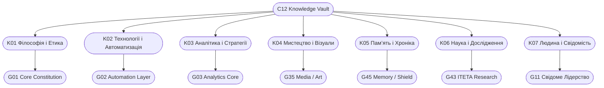

# C12_INDEX.md
## 🧭 ІНДЕКС СКАРБНИЦІ ЗНАНЬ CHECHA_CORE
> **“Карта свідомості — це дзеркало еволюції.”**  
> Автор: `С.Ч.`  
> Версія: v1.0  
> Дата: 10 жовтня 2025 року

---

## 🌍 I. ПРИЗНАЧЕННЯ

`C12_INDEX.md` — це головна карта навігації для C12_KNOWLEDGE_VAULT.  
Вона відображає структуру, зв’язки, стан наповнення та розвиток знань системи.

> “Без карти знань навіть наймудріший заблукає у власній пам’яті.”  
> — `С.Ч.`

---

## 🗂️ II. ГОЛОВНІ КАТЕГОРІЇ ЗНАНЬ

| Код | Назва | Короткий опис | Пов’язано з | Статус |
|------|--------|----------------|--------------|----------|
| K01 | **Філософія і Етика** | Основи моралі, духовні принципи, притчі | C11, G01 | 🟢 Активна |
| K02 | **Технології і Автоматизація** | Скрипти, алгоритми, інструменти автоматизації | C07, G02 | 🟢 Активна |
| K03 | **Аналітика і Стратегії** | Матриці, аналітичні карти, системні рішення | C06, G03 | 🟡 У процесі |
| K04 | **Мистецтво і Візуали** | Артефакти, символи, естетичні коди системи | G04, G35 | 🟢 Активна |
| K05 | **Пам’ять і Хроніка** | Історія, записи, події, хронологія розвитку | C03, G45 | 🟡 У процесі |
| K06 | **Наука і Дослідження** | Теорії, експерименти, гіпотези, відкриття | G43 | 🟢 Активна |
| K07 | **Людина і Свідомість** | Психологія, розвиток, духовна архітектура | G11, G12 | 🟢 Активна |

---

## 🧩 III. ASCII-МАПА ЗНАНЬ

```
┌────────────────────────────────────────────────────┐
│                    C12_INDEX                       │
├──────────────┬──────────────┬──────────────┬────────┤
│   K01        │   K02        │   K03        │   K04  │
│  Філософія   │  Технології  │  Аналітика   │  Мистецтво │
├──────────────┴──────┬───────┴──────┬───────┴──────────┤
│       K05           │       K06     │        K07      │
│      Пам’ять        │      Наука    │     Людина      │
└─────────────────────┴────────────────┴────────────────┘
```

---

## 🔗 IV. ДІАГРАМА ЗВ’ЯЗКІВ



---

## 🧮 V. СТАН НАПОВНЕННЯ (10.10.2025)

| Категорія | Прогрес (%) | Рівень інтеграції | Наступний крок |
|------------|--------------|------------------|----------------|
| K01 | 95% | DAO-G01 / C11 | Оновлення цитат і трактатів |
| K02 | 90% | DAO-G02 / C07 | Додати TECH-README для автоматизацій |
| K03 | 60% | DAO-G03 / C06 | Синхронізація матриць BALANCE / RESTORE |
| K04 | 80% | DAO-G35 / ART | Додати символи CIRCLE / FIRE / SHIELD |
| K05 | 70% | DAO-G45 / LOG | Формування повної хроніки Системи |
| K06 | 88% | DAO-G43 / SCI | Формалізація секцій ITETA |
| K07 | 92% | DAO-G11 / C10 | Відновлення та індекс людських принципів |

---

## 🧠 VI. КОНТРОЛЬ І ОНОВЛЕННЯ

- `Build-KnowledgeIndex.ps1` — автоматичне формування карти знань.
- `Sync-KnowledgeVault.ps1` — синхронізація між C12 та DAO-GOGS.
- `Audit-KnowledgeMap.ps1` — перевірка узгодженості категорій.

---

## 🕊️ VII. ЦИТАТА

> “Мапа — це не територія, але без неї душа не знайде шлях додому.”  
> — `С.Ч.`

---

**CHECHA_CORE | C12_INDEX v1.0**  
**DAO-GOGS LINKED MODULE: G12_KNOWLEDGE_ARCHIVE**
