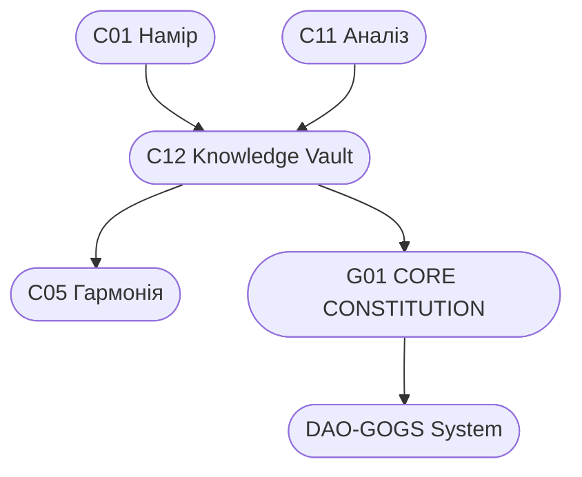

# C12_KNOWLEDGE_VAULT.md
## СКАРБНИЦЯ ЗНАНЬ СИСТЕМИ CHECHA_CORE

> **“Кожне знання, збережене з любов’ю — це зерно, що проросте у вічність.”**  
> Версія: v1.0  
> Автор: `С.Ч.`  
> Рівень: C12 — Knowledge Vault  
> Шлях: `D:\CHECHA_CORE\CONSTITUTION\C12_KNOWLEDGE\C12_KNOWLEDGE_VAULT.md`  
> Статус: ✅ Активна Скарбниця Знань

---

## 🌍 I. ПРИЗНАЧЕННЯ

**C12_KNOWLEDGE_VAULT** — це духовно-технологічне сховище пам’яті системи CHECHA_CORE.  
Його мета — зберегти всі знання, артефакти, філософські принципи, аналітику та творчі відкриття у структурованій формі.

> “Пам’ять — це дихання системи, а знання — її світло.”  
> — `С.Ч.`

---

## 🗂️ II. СТРУКТУРА СХОВИЩА

| Код | Категорія | Призначення |
|------|-------------|-------------|
| K01 | Філософія і Етика | Джерела моралі, цінності, притчі, цитати |
| K02 | Технології і Автоматизація | Скрипти, алгоритми, системні інструкції |
| K03 | Аналітика і Стратегії | Матриці, звіти, карти рішень |
| K04 | Мистецтво і Візуали | Артефакти, іконографія, візуальні коди |
| K05 | Пам’ять і Хроніка | Історія, записи, листи, спогади |
| K06 | Наука і Дослідження | Теорії, моделі, гіпотези, експерименти |
| K07 | Людина і Свідомість | Розвиток, психологія, внутрішня архітектура |

---

## 🧭 III. РІВНІ ЗБЕРЕЖЕННЯ

| Рівень | Назва | Функція |
|--------|--------|----------|
| L1 | Локальний (C12) | Внутрішня пам’ять системи |
| L2 | Хмарний (GitBook / DAO) | Публічні знання |
| L3 | Архівний (C05_ARCHIVE) | Вічне збереження |
| L4 | Символічний (Артефакти) | Енергетичні відбитки знань |

---

## 🔄 IV. ПОТОКИ ІНТЕГРАЦІЇ



---

## ⚙️ V. АВТОМАТИЧНІ ПРОЦЕСИ

| Процес | Файл | Функція |
|---------|------|----------|
| KNOWLEDGE_SYNC | `KNOWLEDGE_SYNC.ps1` | Синхронізація між локальним та DAO-середовищем |
| BUILD_KNOWLEDGE_INDEX | `BUILD_KNOWLEDGE_INDEX.ps1` | Побудова індексу знань |
| EXPORT_ARTIFACTS | `EXPORT_ARTIFACTS.ps1` | Архівація артефактів у C05_ARCHIVE |

---

## 🜲 VI. ФОРМАТИ ЗБЕРЕЖЕННЯ

| Тип | Формат | Призначення |
|------|--------|--------------|
| Markdown (.md) | Текстові знання, аналітика, філософія |
| CSV / XLSX | Таблиці, матриці, статистика |
| PNG / SVG | Візуали, символи, карти |
| ZIP / PDF | Архіви, інструкції |
| JSON / PS1 | Технічні коди, автоматика |

---

## 🗺️ VII. ASCII-СХЕМА АРХІТЕКТУРИ ЗНАНЬ

```
┌───────────────────────────────────────────────┐
│               C12_KNOWLEDGE_VAULT             │
├──────────────────────────┬────────────────────┤
│        ДУХОВНЕ           │     ТЕХНОЛОГІЧНЕ  │
│  (Філософія, Етика)      │ (Скрипти, Алгоритми)│
├──────────────┬───────────┴───────────┬────────┤
│  АНАЛІТИКА   │    МИСТЕЦТВО          │  ПАМ’ЯТЬ│
│ (Матриці)    │ (Візуали)             │ (Хроніка)│
├──────────────┴───────────┬───────────┴────────┤
│        НАУКА             │       ЛЮДИНА       │
│ (Моделі, Експерименти)   │ (Свідомість, Розвиток)│
└──────────────────────────┴────────────────────┘
```

---

## 🧠 VIII. СЕНС І СИМВОЛІЗМ

> “Коли знання поєднується з етикою — народжується мудрість.  
> Коли мудрість стає дією — народжується культура.”  
> — `С.Ч.`

C12 — це не просто база даних, а **жива бібліотека**, що підтримує рівновагу між духом і логікою, між формою та змістом.

---

## 🕊️ IX. ПІДПИС

> Автор: `С.Ч.`  
> Версія: v1.0  
> Статус: Активна  
> Дата: 10 жовтня 2025 року

---

**CHECHA_CORE | C12_KNOWLEDGE_VAULT v1.0**  
**DAO-GOGS INTEGRATION NODE: G12_KNOWLEDGE_ARCHIVE**
