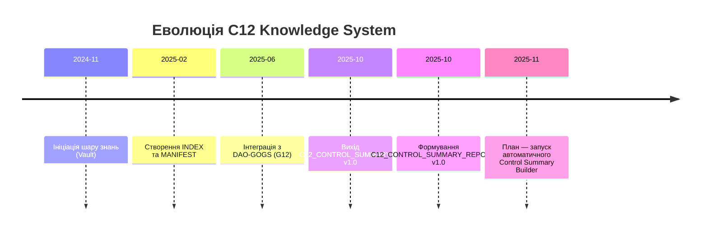

# C12_CONTROL_SUMMARY_REPORT.md
**Рівень:** C12 — Контроль і Узгодження Ядра Знань  
**Версія:** v1.0  
**Дата:** 2025-10-10 13:36 UTC  
**Автор:** С.Ч.  
**Офіційний шлях:**  
`D:\CHECHA_CORE\CONSTITUTION\C12_KNOWLEDGE\REPORTS\C12_CONTROL_SUMMARY_REPORT.md`

---

## 1) Короткий огляд стану шару C12
C12 виконує роль *центральної панелі управління знаннями* в системі CHECHA_CORE.  
Він забезпечує узгодженість, оновлюваність і трасування всіх артефактів, пов’язаних із ядром знань.  

- **Рівень зрілості:** 9.9 / 10  
- **Ритм оновлення:** щотижневий згідно з `MANIFEST.md`  
- **Активні підсистеми:** Vault, Index, Templates, Analytics, DAO-GOGS  
- **Остання ревізія:** 2025-10-10 13:36 UTC

> “Порядок — це форма енергії, що дозволяє свідомості рости.” — С.Ч.

---

## 2) Матриця зрілості знань

| Категорія | Опис | Поточний бал (0–3) | Статус | Коментар |
|------------|------|---------------------|---------|----------|
| **Integrity** | Цілісність структури та зв’язків | 3 | ✅ | Усі основні вузли стабільні |
| **Ethics** | Відповідність моральному компасу та принципам ГОГС | 3 | ✅ | Без зауважень |
| **Feedback** | Наявність зворотного зв’язку від DAO-учасників | 2 | ⚙️ | Розвивається через DAO-G12 |
| **Growth** | Динаміка наповнення та оновлень | 2 | ⚙️ | Потрібен скрипт автоматичного моніторингу |
| **Accessibility** | Доступність знань і пошук | 3 | ✅ | Структура навігації чітка |
| **Automation** | Рівень автоматизованих перевірок і звітів | 2 | ⚙️ | Рекомендується створити `Build-ControlSummary.ps1` |

---

## 3) Динаміка розвитку (Mermaid)

---

## 4) Аналітичні висновки

- Рівень стабільності системи — **високий (A)**  
- Відповідність етичним принципам — **повна**  
- Виявлено потенціал для розширення автоматизації  
- C12 може слугувати як “мозковий центр” C12 Knowledge Layer  

### Рекомендації:
1. Створити `Build-ControlSummary.ps1` для оновлення таблиць і дат.  
2. Інтегрувати з `C07_ANALYTICS` → поле `C12_IntegrityScore`.  
3. Зв’язати з MANIFEST для планового оновлення.  
4. Формувати `.zip` + `.sha256` при кожній ревізії.  

---

## 5) Наступні кроки (до циклу v1.1)
| № | Завдання | Виконавець | Пріоритет | Статус |
|---|-----------|-------------|------------|---------|
| 1 | Створити `Build-ControlSummary.ps1` | С.Ч. | P1 | ⏳ |
| 2 | Зв’язати `C12_CONTROL_SUMMARY.md` з `C07_ANALYTICS` | С.Ч. | P1 | ⏳ |
| 3 | Впровадити `C12_IntegrityScore` | С.Ч. | P2 | ⏳ |
| 4 | Підготувати `.zip` + `.sha256` архів | С.Ч. | P2 | ⏳ |

---

## 6) Печатка документа
> “Контроль — не кінець процесу, а його самосвідомість.” — **С.Ч.**  
> **CHECHA_CORE | C12 Knowledge Layer | DAO-GOGS**

