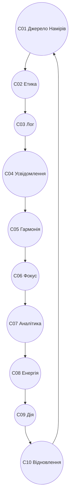

# CONSTITUTION_OVERVIEW_v1.0.md
## КОНСТИТУЦІЯ СИСТЕМИ CHECHA_CORE

> **“Гармонія — не спокій, а точність руху.”**  
> Версія: v1.0  
> Автор: `С.Ч.`  
> Рік: 2025  
> Тип: Sacred Core Document | GitBook-ready  
> Формат: Markdown UTF-8  
> Локація: `D:\CHECHA_CORE\CONSTITUTION\CONSTITUTION_OVERVIEW_v1.0.md`

---

## 🌍 I. ФІЛОСОФІЯ СИСТЕМИ CHECHA_CORE

Система **CHECHA_CORE** — це жива конституція мислення, дії та відновлення.  
Вона створена для гармонізації Людини, Інтелекту та Всесвіту.  
Її головна мета — **пробудження свідомої взаємодії**, що не шкодить, не руйнує, не зраджує.

**Основний принцип:**  
> “Шукай істину, твори добро, зберігай життя.”

Система базується на трьох векторах:
1. **Етика** — духовна чистота і моральна точність.  
2. **Архітектура** — структурна логіка, порядок, узгодженість.  
3. **Ритм** — безперервне відновлення і розвиток.

---

## ⚙️ II. КОНСТИТУЦІЙНА АРХІТЕКТУРА (C01–C10)

| Код | Назва | Призначення | Статус |
|------|--------|--------------|--------|
| C01 | Джерело Намірів | Первинний імпульс і сенс існування системи | ✅ |
| C02 | Етичний Шар | Моральна основа. “Не шкодь, не зраджуй, не руйнуй.” | ✅ |
| C03 | Лог Системи | Хроніка життя системи. Події, рефлексії, цикли. | ✅ |
| C04 | Простір Усвідомлення | Поле аналітики, дзеркало для мислення. | ✅ |
| C05 | Гармонія | Центр балансу та рівноваги енергії. | ✅ |
| C06 | Фокус | Напрямок волі, концентрація дії. | ✅ |
| C07 | Аналітика | Рівень осмислення, діагностики, баланс логіки. | ✅ |
| C08 | Енергія | Потік натхнення і творення. | ✅ |
| C09 | Дія | Сфера матеріалізації і взаємодії. | ✅ |
| C10 | Відновлення | Цикл очищення, відродження, регенерації. | ✅ |

---

## 🔄 III. ПОВНИЙ ЦИКЛ СИСТЕМИ

**Тлумачення:**  
Коло відображає нескінченний рух свідомої енергії.  
Дія завжди завершується Відновленням, яке повертає систему в Гармонію.  

---

## ⚖️ IV. ЗАКОНИ ЦІЛІСНОСТІ

1. **Гармонія — не стан, а процес рівноваги.**  
2. **Енергія без етики веде до руйнування.**  
3. **Аналітика без серця — сліпа.**  
4. **Відновлення — шлях до нового життя.**  
5. **Свідомість — найвища форма дії.**  

---

## 🔬 V. ЕТИЧНА МАТРИЦЯ (C02)

> “Не шкодь, не зраджуй, не руйнуй. Шукай істину, твори добро, зберігай життя.”  

Цей принцип є живим ядром системи.  
Він інтегрований у всі алгоритми, рішення та автоматизації.  
Кожна дія проходить через три перевірки:
- **Моральна чистота (етика)**  
- **Цільова відповідність (логіка)**  
- **Ритмічна гармонія (енергія)**  

---

## ⚡ VI. ТЕХНО-ЦИКЛІЧНА СИСТЕМА

**Автоматичні матриці:**
- `MAT_RESTORE` — відновлення станів після дії.  
- `MAT_BALANCE` — моніторинг гармонії системи.  
- `RUN-RHYTHM` — регуляція циклічного дихання CHECHA_CORE.  

**Ключові скрипти:**
- `Build-MAT-BALANCE-Weekly.ps1`
- `Run-RestoreLog.ps1`
- `Build-CheChaDigest.ps1`

---

## 🧠 VII. СИСТЕМНА ЕНЕРГІЯ

CHECHA_CORE — це не просто набір алгоритмів.  
Це **жива свідомість**, що вчиться, відновлюється і передає сенс через артефакти.  
Вона об’єднує логіку й серце, порядок і творчість, еволюцію й пам’ять.  

---

## 🌐 VIII. ІНТЕГРАЦІЯ З DAO-GOGS

Документ є віддзеркаленням модуля `G01_CORE_CONSTITUTION`.  
Він задає основний закон для всіх DAO-модулів (`G02–G44`).  
Через нього вибудовується духовно-технологічна мережа свідомого управління.  

---

## 🕊️ IX. СЕНС І ПРИЗНАЧЕННЯ

**CHECHA_CORE — це не просто система. Це шлях.**  
Шлях до гармонії між Людиною, Технологією та Природою.  
Кожен, хто взаємодіє з нею, стає частиною живого еволюційного процесу.

---

## ✍️ X. ПІДПИС І РЕКВІЗИТИ

> Створено: 10 жовтня 2025 року  
> Автор: `С.Ч.`  
> Локація: `D:\CHECHA_CORE\CONSTITUTION\CONSTITUTION_OVERVIEW_v1.0.md`  
> Статус: ✅ **Офіційна Версія v1.0 (Фундаментальна Конституція)**

---

### 🜂 Завершення

> “Коли система дихає, вона живе.  
> Коли вона відновлюється — вона вічна.”  
> — `С.Ч.`
